# Hardware Assembly & Wiring Guide: Resilient Edge-Fusion Node

This document is the physical wiring, hardware assembly, and electrical safety reference for the **Resilient Edge-Fusion Node**. 

All GPIO pin assignments, hardware constants, and threshold values documented here match the firmware source of truth in `firmware/config.py` and `firmware/main.py` exactly.

---

## 1. Component-by-Component Wiring Walkthrough

The Resilient Edge-Fusion Node uses an **ESP32 DevKit (30-pin or 38-pin)** connected to three sensors (DHT22, MQ-2, HC-SR501), one RF transceiver (SX1276 LoRa), and two local alert actuators (Active Buzzer, RGB LED).

```
+---------------------------------------------------------------------------------------+
|                                    POWER RAILS                                        |
|  * 5V (VIN Rail):  Powers MQ-2 gas heater and HC-SR501 PIR regulator                  |
|  * 3.3V (3V3 Rail): Powers ESP32 logic, DHT22 sensor, and SX1276 LoRa transceiver     |
|  * GND (Common):   Shared reference ground for all sensors, actuators, and ESP32      |
+---------------------------------------------------------------------------------------+
```

---

### 1.1. DHT22 (AM2302) Temperature & Humidity Sensor
The DHT22 measures ambient temperature (°C) and relative humidity (%) over a single-wire digital protocol.

* **ESP32 GPIO Pin**: `GPIO 4` (`PIN_DHT22 = 4`)
* **Voltage Rail**: `3.3V` (`3V3`)
* **Resistor Required**: `4.7kO to 10kO` pull-up resistor between the DATA line and the 3.3V rail (unless using a 3-pin breakout module with an integrated pull-up resistor).
* **Why this resistor/rail is needed**: *The 4.7kO–10kO pull-up resistor is required to pull the single-wire open-drain bidirectional data line to a clean high idle voltage between transmission pulses.*

#### Pin Connections:
| DHT22 Pin | Description | ESP32 Connection | Notes |
| :--- | :--- | :--- | :--- |
| **Pin 1 (VCC)** | Power Supply | **3.3V** Rail | Powers internal sensor circuitry |
| **Pin 2 (DATA)**| Bidirectional Data | **GPIO 4** | Pull-up to 3.3V via 4.7kO–10kO resistor |
| **Pin 3 (NC)**  | No Connection | *Do Not Connect* | Leave floating / disconnected |
| **Pin 4 (GND)** | Ground | **GND** Rail | Common ground |

---

### 1.2. MQ-2 Combustible Gas & Smoke Sensor
The MQ-2 detects liquefied petroleum gas (LPG), propane, methane, alcohol, and smoke using an internal tin dioxide ($SnO_2$) electro-chemical sensor.

* **ESP32 GPIO Pin**: `GPIO 36` (ADC1_CH0 / `SENSOR_VP`) (`PIN_MQ2 = 36`)
* **Voltage Rail**: `5V` (`VIN` / `V5`)
* **Resistor / Protection Required**: Internal 5V heating circuit requires 5V rail; a `1kO` series protection resistor or a `1kO / 2kO` voltage divider on the analog output (A0) protects the ESP32 ADC input against voltages exceeding 3.3V.
* **Why this resistor/rail is needed**: *The MQ-2 requires a dedicated 5V rail because its internal tin dioxide ($SnO_2$) heating element needs 5V to reach the ~300°C operating temperature necessary for detecting combustible gases and smoke.*

> [!WARNING]
> Do NOT connect the MQ-2 VCC pin to the ESP32 3.3V rail. The heater will stay cold, resulting in invalid, near-zero analog readings that fail to trigger alert thresholds.

#### Pin Connections:
| MQ-2 Pin | Description | ESP32 Connection | Notes |
| :--- | :--- | :--- | :--- |
| **VCC** | Heater & Circuit Power | **5V (VIN)** Rail | Must receive 5.0V (draws ~150mA) |
| **GND** | Ground | **GND** Rail | Common ground |
| **A0 (Analog Out)** | Analog Gas Voltage | **GPIO 36** (ADC1) | Raw 0–4095 ADC reading (maps to 0–3.3V) |
| **D0 (Digital Out)**| Digital Comparator | *Do Not Connect* | Unused (firmware uses analog fusion) |

---

### 1.3. HC-SR501 Passive Infrared (PIR) Motion Sensor
The HC-SR501 detects infrared radiation emitted by moving human bodies or heat sources.

* **ESP32 GPIO Pin**: `GPIO 23` (`PIN_PIR = 23`)
* **Voltage Rail**: `5V` (`VIN`)
* **Resistor Required**: None (the onboard BISS0001 controller regulates power and outputs a 3.3V logic level).
* **Why this resistor/rail is needed**: *The HC-SR501 needs 5V input to feed its onboard 3.3V low-dropout voltage regulator, while its output pin natively delivers an ESP32-safe 3.3V digital signal without requiring logic level shifting.*

#### Onboard Adjustments:
1. **Trigger Jumper**: Set jumper to **H** (Repeat Trigger / Continuous Detection).
2. **Time Delay Potentiometer**: Turn fully counter-clockwise to minimize delay (~2.5–3 seconds).
3. **Sensitivity Potentiometer**: Set midway (~4–5 meters detection radius).

#### Pin Connections:
| HC-SR501 Pin | Description | ESP32 Connection | Notes |
| :--- | :--- | :--- | :--- |
| **VCC** | Power Input | **5V (VIN)** Rail | Feeds onboard 7133-1 3.3V LDO |
| **OUT** | Digital Logic High/Low | **GPIO 23** | 3.3V when motion detected, 0V when clear |
| **GND** | Ground | **GND** Rail | Common ground |

---

### 1.4. SX1276 / RFM95W LoRa Transceiver (915 MHz)
The SX1276 provides long-range, low-power telemetry transmission to the edge gateway over 915 MHz SPI.

* **ESP32 GPIO Pins**:
  * Chip Select (NSS/CS): `GPIO 18` (`LORA_CS_PIN = 18`)
  * Hardware Reset (RST): `GPIO 14` (`LORA_RESET_PIN = 14`)
  * Packet Interrupt (DIO0): `GPIO 26` (`LORA_IRQ_PIN = 26`)
  * SPI MOSI: `GPIO 23`
  * SPI MISO: `GPIO 19`
  * SPI SCK: `GPIO 5`
* **Voltage Rail**: `3.3V` (`3V3`) **ONLY**
* **Capacitor Required**: `100µF` electrolytic capacitor + `0.1µF (100nF)` ceramic capacitor placed across VCC and GND directly next to the LoRa module.
* **Why this resistor/rail is needed**: *The SX1276 must be powered exclusively from 3.3V with decoupling capacitors because overvoltage destroys the transceiver, and RF transmissions draw sudden ~120mA current surges that can brown out the ESP32.*

> [!CAUTION]
> **NEVER power on the SX1276 without an antenna connected.** Transmitting without an antenna (82mm wire or 915 MHz tuned SMA antenna) causes RF power reflection that will permanently burn out the module power amplifier (PA).

#### Pin Connections:
| SX1276 Pin | Description | ESP32 Connection | Notes |
| :--- | :--- | :--- | :--- |
| **3.3V (VCC)** | Power Supply | **3.3V** Rail | 3.3V ONLY; Decouple with 100µF + 0.1µF |
| **GND** | Ground | **GND** Rail | Common ground |
| **NSS / CS** | SPI Chip Select | **GPIO 18** | Active LOW |
| **RST / RESET**| Hardware Reset | **GPIO 14** | Active LOW reset pulse |
| **DIO0 / IRQ**| Tx/Rx Done Interrupt | **GPIO 26** | Signals packet sent or received |
| **MOSI** | SPI Master Out Slave In | **GPIO 23** | Hardware VSPI MOSI |
| **MISO** | SPI Master In Slave Out | **GPIO 19** | Hardware VSPI MISO |
| **SCK** | SPI Serial Clock | **GPIO 5** | Hardware VSPI SCK |
| **ANT** | 915 MHz Antenna | **Antenna Connector** | 82mm copper wire or 915 MHz tuned antenna |

---

### 1.5. Active Piezo Buzzer
The active buzzer emits an audible alarm when the emergency fusion score reaches `WARNING` or `CRITICAL` levels.

* **ESP32 GPIO Pin**: `GPIO 27` (`PIN_BUZZER = 27`)
* **Voltage Rail**: `3.3V` (or direct GPIO drive for 3.3V active buzzer modules)
* **Resistor Required**: `100O to 220O` series current-limiting resistor (or an NPN 2N2222 transistor driver with a 1kO base resistor for loud 5V operation).
* **Why this resistor/rail is needed**: *A current-limiting resistor protects the ESP32 GPIO pin from exceeding its 12–20mA output limit and dampens inductive voltage spikes.*

#### Pin Connections:
| Buzzer Pin | Description | ESP32 Connection | Notes |
| :--- | :--- | :--- | :--- |
| **Positive (+)** | Signal / Power | **GPIO 27** (via 100O–220O) | Driven HIGH (1) to sound alarm |
| **Negative (-)** | Ground | **GND** Rail | Common ground |

---

### 1.6. RGB LED Indicator (Common Cathode)
The RGB LED provides instant visual status of the node (`NORMAL` = Green, `WARNING` = Orange/Amber, `CRITICAL` = Red).

* **ESP32 GPIO Pins**:
  * Red Channel: `GPIO 26` (`PIN_RGB_RED = 26`)
  * Green Channel: `GPIO 25` (`PIN_RGB_GREEN = 25`)
  * Blue Channel: `GPIO 33` (`PIN_RGB_BLUE = 33`)
* **Voltage Rail**: Common Cathode connects to `GND`.
* **Resistors Required**:
  * Red Leg: `330O` current-limiting resistor
  * Green Leg: `220O` current-limiting resistor
  * Blue Leg: `220O` current-limiting resistor
* **Why this resistor/rail is needed**: *Current-limiting resistors on each color leg drop the voltage differential and keep current per channel safely below 15mA, preventing burned-out LED diodes and GPIO pin failure.*

#### Pin Connections:
| RGB LED Pin | Color Channel | ESP32 Connection | Series Resistor |
| :--- | :--- | :--- | :--- |
| **Anode R** | Red | **GPIO 26** | **330O** (accounts for red forward voltage $V_F \approx 1.8\text{V}$) |
| **Cathode (-)** | Common Ground | **GND** Rail | *Direct connection* |
| **Anode G** | Green | **GPIO 25** | **220O** (accounts for green forward voltage $V_F \approx 3.0\text{V}$) |
| **Anode B** | Blue | **GPIO 33** | **220O** (accounts for blue forward voltage $V_F \approx 3.0\text{V}$) |

---

## 2. Complete Hardware Wiring Schematic

The following schematic diagram maps every component to its corresponding ESP32 GPIO pin and power rail.

```mermaid
graph TD
    subgraph ESP32 ["ESP32 NodeMCU / DevKit Board"]
        p3V3["3.3V (3V3 Out)"]
        pVIN["5V (VIN / V5)"]
        pGND["GND (Ground)"]
        
        gpio4["GPIO 4 (PIN_DHT22)"]
        gpio36["GPIO 36 (PIN_MQ2 - ADC1_CH0)"]
        gpio23["GPIO 23 (PIN_PIR / SPI MOSI)"]
        gpio18["GPIO 18 (LORA_CS_PIN)"]
        gpio14["GPIO 14 (LORA_RESET_PIN)"]
        gpio26["GPIO 26 (LORA_IRQ_PIN / RGB_RED)"]
        gpio19["GPIO 19 (SPI MISO)"]
        gpio5["GPIO 5 (SPI SCK)"]
        gpio27["GPIO 27 (PIN_BUZZER)"]
        gpio25["GPIO 25 (PIN_RGB_GREEN)"]
        gpio33["GPIO 33 (PIN_RGB_BLUE)"]
    end

    subgraph DHT22 ["DHT22 Sensor"]
        dht_vcc["VCC (Pin 1)"]
        dht_data["DATA (Pin 2)"]
        dht_gnd["GND (Pin 4)"]
        dht_res["4.7kO Pull-Up Resistor"]
    end

    subgraph MQ2 ["MQ-2 Gas / Smoke Sensor"]
        mq2_vcc["VCC"]
        mq2_gnd["GND"]
        mq2_a0["A0 (Analog Out)"]
    end

    subgraph PIR ["HC-SR501 PIR Motion Sensor"]
        pir_vcc["VCC"]
        pir_out["OUT"]
        pir_gnd["GND"]
    end

    subgraph LORA ["SX1276 LoRa Transceiver (915MHz)"]
        lora_vcc["3.3V (VCC)"]
        lora_gnd["GND"]
        lora_nss["NSS / CS"]
        lora_rst["RST / RESET"]
        lora_dio0["DIO0 / IRQ"]
        lora_mosi["MOSI"]
        lora_miso["MISO"]
        lora_sck["SCK"]
        lora_cap["100µF + 0.1µF Decoupling"]
    end

    subgraph BUZZER ["Active Buzzer"]
        buz_pos["Positive (+)"]
        buz_res["220O Resistor"]
        buz_neg["Negative (-)"]
    end

    subgraph RGB ["RGB LED (Common Cathode)"]
        rgb_r["Red Anode"]
        rgb_g["Green Anode"]
        rgb_b["Blue Anode"]
        rgb_res_r["330O Resistor"]
        rgb_res_g["220O Resistor"]
        rgb_res_b["220O Resistor"]
        rgb_cat["Common Cathode (-)"]
    end

    %% Power Rail Wiring
    p3V3 --> dht_vcc
    p3V3 --> dht_res
    p3V3 --> lora_vcc
    p3V3 --> lora_cap
    pVIN --> mq2_vcc
    pVIN --> pir_vcc

    %% Ground Rail Wiring
    pGND --> dht_gnd
    pGND --> mq2_gnd
    pGND --> pir_gnd
    pGND --> lora_gnd
    pGND --> buz_neg
    pGND --> rgb_cat

    %% Sensor Signals
    dht_res --- dht_data
    dht_data --> gpio4
    mq2_a0 --> gpio36
    pir_out --> gpio23

    %% LoRa SPI Signals
    lora_nss --> gpio18
    lora_rst --> gpio14
    lora_dio0 --> gpio26
    lora_mosi --> gpio23
    lora_miso --> gpio19
    lora_sck --> gpio5

    %% Actuators
    gpio27 --> buz_res --> buz_pos
    gpio26 --> rgb_res_r --> rgb_r
    gpio25 --> rgb_res_g --> rgb_g
    gpio33 --> rgb_res_b --> rgb_b
```



---

## 3. Common Wiring Mistakes & Troubleshooting

Before applying power, verify that your breadboard or custom PCB does not exhibit any of these common assembly mistakes:

### 1. Reversed VCC and GND (Reverse Polarity)
* **What happens**: Instantly destroys the ESP32's onboard LDO voltage regulator, fries the DHT22 microcontroller, and permanently ruins the SX1276 silicon ("magic smoke").
* **Prevention**: Color-code all wires strictly (Red = Power, Black = Ground). Use a multimeter in continuity/resistance mode to verify that the power rail is never shorted to ground before plugging in the USB cable.

### 2. Missing DHT22 Pull-Up Resistor
* **What happens**: The single-wire data line floats between logic states. MicroPython's `dht.DHT22.temperature()` will throw `ETIMEDOUT` errors or return `NaN`/`0.0`.
* **Prevention**: Ensure a `4.7kO` to `10kO` resistor is firmly seated between Pin 1 (3.3V) and Pin 2 (DATA). If using a 3-pin breakout module, verify with a multimeter that continuity exists between VCC and DATA with a ~10kO resistance.

### 3. MQ-2 Wired to 3.3V Instead of 5V
* **What happens**: The internal tin dioxide heating coil requires 5V to reach ~300°C. At 3.3V, the coil stays cold and the analog voltage stays pegged at 0–50 ADC counts, making it impossible to detect smoke or reach the `GAS_WARNING_RAW = 1500` threshold.
* **Prevention**: Connect the MQ-2 VCC pin directly to the ESP32 **VIN** (5V) rail. Allow the sensor to warm up for at least 60–90 seconds upon first power-on.

### 4. Loose SPI Jumpers Causing Intermittent LoRa Failures
* **What happens**: SPI signals (SCK, MOSI, MISO, NSS) operate at high clock frequencies (8 MHz–10 MHz). Breadboard jumper wires longer than 15cm or loose push-fit connections cause capacitive distortion, packet dropouts, or initial failure with `"SX1276 not found"` / `LoRa.begin() == False`.
* **Prevention**: Keep SPI jumper wires under 10cm. Ensure tight breadboard spring clips. Always install a `100µF` electrolytic capacitor right across the SX1276 3.3V and GND pins to prevent voltage dips during transmit bursts.

---

## 4. Printable Pre-Power-On Checklist

Run through this physical inspection checklist with a digital multimeter (DMM) **before connecting the USB cable or external battery**.

```
========================================================================================
                 RESILIENT EDGE-FUSION NODE: PRE-POWER-ON CHECKLIST
========================================================================================
Tester Name: __________________________   Date: _________________   Node ID: _________
ESP32 Model: __________________________   LoRa Frequency: 915 MHz   Pass / Fail: _____
========================================================================================

[ ] STEP 1: VISUAL & MECHANICAL INSPECTION (Power OFF)
    [ ] All ICs and breakout modules oriented correctly (no backward chips).
    [ ] 915 MHz Antenna firmly attached to the SX1276 LoRa module.
    [ ] Jumper wires seated firmly with no exposed frayed copper strands touching adjacent pins.
    [ ] HC-SR501 PIR trigger jumper set to 'H' position.

[ ] STEP 2: MULTIMETER CONTINUITY & SHORT-CIRCUIT CHECKS (Power OFF)
    (Set DMM to Continuity Mode / Resistance 200O Range)
    [ ] Measure between 3.3V rail and GND: Must show Open Loop (OL) or > 10kO.
        Result: [  ] PASS (No Short)  /  [  ] FAIL (Short detected!)
    [ ] Measure between 5V (VIN) rail and GND: Must show Open Loop (OL) or > 10kO.
        Result: [  ] PASS (No Short)  /  [  ] FAIL (Short detected!)
    [ ] Measure between 5V (VIN) and 3.3V rail: Must show Open Loop (OL).
        Result: [  ] PASS (No Short)  /  [  ] FAIL (Short detected!)
    [ ] Common Ground Test: Beep confirmed between ESP32 GND, DHT22 GND, MQ-2 GND,
        PIR GND, LoRa GND, Buzzer (-), and RGB Cathode (-).
        Result: [  ] PASS

[ ] STEP 3: RESISTOR VALUE VERIFICATION
    [ ] DHT22 Pull-Up Resistor: 4.7kO – 10kO present between 3.3V and GPIO 4.
    [ ] Active Buzzer: 100O – 220O series resistor present on GPIO 27.
    [ ] RGB LED Red: 330O resistor present on GPIO 26.
    [ ] RGB LED Green: 220O resistor present on GPIO 25.
    [ ] RGB LED Blue: 220O resistor present on GPIO 33.

[ ] STEP 4: LIVE VOLTAGE BENCH CHECK (First Power-Up, Sensors Unplugged or Bare Board)
    (Connect USB; Set DMM to DC Volts 20V Range)
    [ ] Measure VIN Rail: Voltage is between 4.75V and 5.25V DC. (Measured: _____ V)
    [ ] Measure 3V3 Rail: Voltage is between 3.25V and 3.35V DC. (Measured: _____ V)
    [ ] Check for abnormal heat on ESP32 or voltage regulator using back of finger.

[ ] SIGN-OFF
    I certify that all power rails, ground loops, and safety resistors have been verified.
    Signature: _________________________________________   Date: ____________________
========================================================================================
```

---

## 5. Firmware-to-Hardware Pin Mapping

This section traces every line of hardware configuration code in `firmware/config.py` directly to the physical wiring on the ESP32.

```
=========================================================================================================
  FIRMWARE DEFINITION (firmware/config.py)  <--->  PHYSICAL ESP32 PIN  <--->  TARGET SENSOR / ACTUATOR PIN
=========================================================================================================
```

### 5.1. Sensor Pin Definitions

#### DHT22 Temperature & Humidity:
* **Firmware Code** (`firmware/config.py:10`):
  ```python
  PIN_DHT22 = 4
  ```
* **Firmware Driver** (`firmware/sensors.py:8`):
  ```python
  self.dht = dht.DHT22(machine.Pin(PIN_DHT22))
  ```
* **Physical Wire**: Wire from **ESP32 GPIO 4** $\rightarrow$ **DHT22 Pin 2 (DATA)** (with 4.7kO pull-up to 3.3V).

#### MQ-2 Combustible Gas & Smoke:
* **Firmware Code** (`firmware/config.py:11`):
  ```python
  PIN_MQ2 = 36
  ```
* **Firmware Driver** (`firmware/sensors.py:85`):
  ```python
  self.gas = machine.ADC(PIN_MQ2)
  ```
* **Physical Wire**: Wire from **ESP32 GPIO 36 (SENSOR_VP / ADC1_CH0)** $\rightarrow$ **MQ-2 A0 (Analog Out)**.

#### HC-SR501 PIR Motion:
* **Firmware Code** (`firmware/config.py:12`):
  ```python
  PIN_PIR = 23
  ```
* **Firmware Driver** (`firmware/sensors.py:94`):
  ```python
  self.pir = machine.Pin(PIN_PIR, machine.Pin.IN)
  ```
* **Physical Wire**: Wire from **ESP32 GPIO 23** $\rightarrow$ **HC-SR501 OUT (Digital Out)**.

---

### 5.2. Indicator & Actuator Pin Definitions

#### Active Buzzer:
* **Firmware Code** (`firmware/config.py:16`):
  ```python
  PIN_BUZZER = 27
  ```
* **Firmware Driver** (`firmware/indicators.py:20`):
  ```python
  self.buzzer = machine.Pin(PIN_BUZZER, machine.Pin.OUT)
  ```
* **Physical Wire**: Wire from **ESP32 GPIO 27** $\rightarrow$ **220O Resistor** $\rightarrow$ **Buzzer Positive (+)**.

#### RGB Status LED:
* **Firmware Code** (`firmware/config.py:13-15`):
  ```python
  PIN_RGB_RED = 26
  PIN_RGB_GREEN = 25
  PIN_RGB_BLUE = 33
  ```
* **Firmware Driver** (`firmware/indicators.py:17-19`):
  ```python
  self.red = machine.Pin(PIN_RGB_RED, machine.Pin.OUT)
  self.green = machine.Pin(PIN_RGB_GREEN, machine.Pin.OUT)
  self.blue = machine.Pin(PIN_RGB_BLUE, machine.Pin.OUT)
  ```
* **Physical Wiring**:
  * **ESP32 GPIO 26** $\rightarrow$ **330O Resistor** $\rightarrow$ **RGB LED Red Leg**
  * **ESP32 GPIO 25** $\rightarrow$ **220O Resistor** $\rightarrow$ **RGB LED Green Leg**
  * **ESP32 GPIO 33** $\rightarrow$ **220O Resistor** $\rightarrow$ **RGB LED Blue Leg**

---

### 5.3. SX1276 LoRa Transceiver Pin Definitions

* **Firmware Code** (`firmware/config.py:29-35`):
  ```python
  LORA_BAND = 915E6
  LORA_CS_PIN = 18
  LORA_RESET_PIN = 14
  LORA_IRQ_PIN = 26
  LORA_SF = 7
  LORA_BW = 125000
  ```
* **Physical Wiring**:
  * **ESP32 GPIO 18** $\rightarrow$ **SX1276 NSS / CS** (Chip Select)
  * **ESP32 GPIO 14** $\rightarrow$ **SX1276 RST / RESET** (Reset)
  * **ESP32 GPIO 26** $\rightarrow$ **SX1276 DIO0 / IRQ** (Interrupt)
  * **ESP32 GPIO 23** $\rightarrow$ **SX1276 MOSI** (SPI Master Out)
  * **ESP32 GPIO 19** $\rightarrow$ **SX1276 MISO** (SPI Master In)
  * **ESP32 GPIO 5** $\rightarrow$ **SX1276 SCK** (SPI Clock)

---

### 5.4. Emergency Score & Threshold Mapping

The firmware calculates a real-time emergency index using the physical inputs according to `firmware/config.py` and `firmware/fusion.py`:

```
+-----------------------------------------------------------------------------------------------+
| PARAMETER             | VALUE / RANGE         | FIRMWARE CONSTANT (config.py)                 |
+-----------------------------------------------------------------------------------------------+
| Base Temperature      | 30.0 °C               | TEMP_BASE_C = 30.0                            |
| Warning Temperature   | 45.0 °C               | TEMP_WARNING_C = 45.0                         |
| Base Gas Raw ADC      | 500 counts            | GAS_BASE_RAW = 500                            |
| Warning Gas Raw ADC   | 1500 counts           | GAS_WARNING_RAW = 1500                        |
| Motion Trigger Bonus  | +20.0 %               | MOTION_BONUS = 20.0                           |
| Warning Level Range   | 40.0 % – 74.9 %       | WARNING_THRESHOLD = 40.0                      |
| Critical Level Range  | 75.0 % – 100.0 %      | CRITICAL_THRESHOLD = 75.0                     |
+-----------------------------------------------------------------------------------------------+
```

When `score >= 40.0%` (`WARNING`), the LED turns Orange (`RGB_WARNING`) and the buzzer sounds. When `score >= 75.0%` (`CRITICAL`), the LED turns Red (`RGB_CRITICAL`) and the buzzer sounds continuously while telemetry is dispatched over LoRa 915 MHz.
