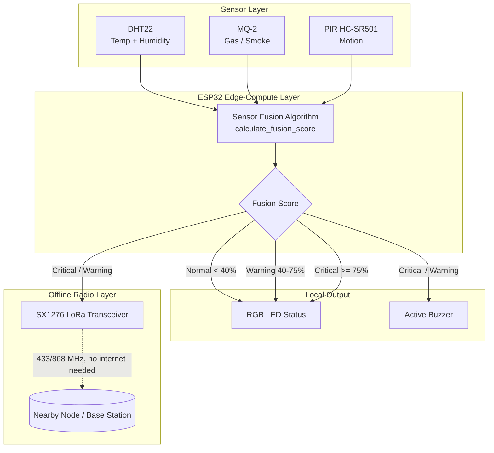

# 🛰️ Resilient Edge-Fusion Node
### Offline Multi-Sensor Emergency Alerting with False-Alarm Mitigation

An integrated hardware-software system that moves threat-verification logic to the network edge, fusing temperature, gas, and motion data on-device and broadcasting alerts over an offline peer-to-peer LoRa link — no cellular network, internet, or centralized server required.

> B.Tech Mini-Project | ESP32 · MicroPython · LoRa (SX1276) · Multi-Sensor Fusion

---

## Table of Contents
1. [Project Overview](#1-project-overview)
2. [System Architecture](#2-system-architecture)
3. [Bill of Materials](#3-bill-of-materials)
4. [Pin Connection Map](#4-pin-connection-map)
5. [Hardware Assembly (Step-by-Step)](#5-hardware-assembly-step-by-step)
6. [Firmware: Sensor Fusion Logic](#6-firmware-sensor-fusion-logic)
7. [Software Setup & Deployment](#7-software-setup--deployment)
8. [Full Hardware ⇄ Software Integration Workflow](#8-full-hardware--software-integration-workflow)
9. [Testing & Validation](#9-testing--validation)
10. [Repository Structure](#10-repository-structure)
11. [Contributing (For Teammates)](#11-contributing-for-teammates)
12. [References](#12-references)
13. [Appendix: AI Prompt for Google Antigravity](#13-appendix-ai-prompt-for-google-antigravity)
14. [Hardware Assembly & Wiring Guide (docs/HARDWARE.md)](docs/HARDWARE.md)

---

## 1. Project Overview

Modern smart-safety systems fail in three predictable ways: they cry wolf (single-sensor false alarms causing alert fatigue), they go dark exactly when needed (cloud/network dependency during outages), and they don't talk to each other (siloed sensors with no cross-verification).

This project answers all three with a single low-cost node:
- **Fusion, not thresholds** — DHT22 (heat), MQ-2 (gas/smoke), and PIR (motion) readings are combined into one confidence score on-chip, so no single noisy sensor can trigger a false alarm.
- **Offline-first** — All computation happens locally on the ESP32; alerts go out over LoRa (433/868 MHz), which needs no internet, cell signal, or grid power to function.
- **~₹1,565 (~$19) total BOM cost**, using components sourced entirely from the Indian hobbyist market.

## 2. System Architecture



**Design principle:** everything inside the "Edge" box runs with zero network dependency — the node is fully functional during a total grid and cellular outage.

## 3. Bill of Materials

| # | Component | Key Specs | Cost (INR) | Typical Indian Vendor |
|---|---|---|---|---|
| 1 | ESP32 Dev Board | 30-pin, Dual-Core 240MHz, 4MB Flash, Wi-Fi+BT | ₹450 | Robu.in / Quartz Components |
| 2 | SX1276 LoRa Module | 868/433 MHz, SPI, +20dBm | ₹350 | Quartz Components / Robu.in |
| 3 | DHT22 Sensor | -40–80°C (±0.5°C), 0–100% RH | ₹220 | Robu.in / Quartz Components |
| 4 | MQ-2 Gas/Smoke Sensor | Analog/Digital out, LPG/smoke/CO/propane | ₹80 | Quartz Components / Amazon.in |
| 5 | HC-SR501 PIR Sensor | Adjustable sensitivity & delay, 3–5V | ₹70 | Local Electronics Shops |
| 6 | 5V Active Buzzer | >85dB @ 10cm | ₹15 | Local Electronics Shops |
| 7 | RGB LED (Common Cathode) | 5mm diffused | ₹10 | Local Electronics Shops |
| 8 | TP4056 Charger + 18650 Battery | 2000mAh Li-Ion | ₹250 | Robu.in / Quartz Components |
| 9 | Breadboard + Jumper Wires | 830-point, 40pcs M-F/M-M | ₹120 | Robu.in / Local Shops |
| | **TOTAL** | | **₹1,565** | |

## 4. Pin Connection Map

| Sensor / Actuator | Sensor Pin | ESP32 Pin | Connection Type |
|---|---|---|---|
| **DHT22** | VCC / GND / DATA | 3.3V / GND / GPIO 4 | Digital Input |
| **MQ-2** | VCC / GND / A0 | 5V(Vin) / GND / GPIO 34 | Analog Input (ADC1_CH6) |
| **PIR HC-SR501** | VCC / GND / OUT | 5V(Vin) / GND / GPIO 13 | Digital Input |
| **SX1276 LoRa** | VCC / GND / SCK / MISO / MOSI / NSS / RST / DIO0 | 3.3V / GND / GPIO 18 / GPIO 19 / GPIO 23 / GPIO 5 / GPIO 14 / GPIO 2 | SPI |
| **Active Buzzer** | VCC / GND (via NPN) | 5V rail / GPIO 12 | Digital Output |
| **RGB LED** | R / G / B / GND | GPIO 25 / GPIO 26 / GPIO 27 / GND | PWM Output |

## 5. Hardware Assembly (Step-by-Step)

1. **Mount the ESP32** on the breadboard so the center divider isolates the left/right pin columns.
2. **Build the power rails** — connect ESP32 `3.3V` and `GND` to the breadboard rails. MQ-2 and PIR draw VCC from the `5V` (Vin) pin instead of 3.3V.
3. **Wire the DHT22** — VCC→3.3V, GND→GND, DATA→GPIO 4, with a **10kΩ pull-up resistor** between DATA and 3.3V to stabilize the 1-Wire signal.
4. **Wire the MQ-2** — VCC→5V, GND→GND, A0→GPIO 34 (reads 0–3.3V proportional to gas concentration).
5. **Wire the PIR** — VCC→5V, GND→GND, OUT→GPIO 13. Set the onboard sensitivity pot to max and delay pot to minimum (~3s).
6. **Wire the SX1276 LoRa module** using *short* jumper wires to avoid SPI signal loss: SCK→18, MISO→19, MOSI→23, NSS/CS→5, RST→14, DIO0→2. Attach a ¼-wavelength antenna (~8.2cm @ 915MHz / ~8.6cm @ 868MHz).
7. **Assemble outputs** — Buzzer's negative terminal → collector of a BC547 NPN transistor (emitter→GND, base→1kΩ resistor→GPIO 12). RGB LED common cathode→GND, R/G/B anodes through 220Ω resistors →GPIO 25/26/27.

## 6. Firmware: Sensor Fusion Logic

The firmware (`firmware/main.py`) runs a weighted fusion score every 2.5 seconds:

| Component | Max Contribution | Trigger Logic |
|---|---|---|
| Temperature (DHT22) | 40% | Scales linearly from 30°C, saturates at ≥45°C |
| Gas/Smoke (MQ-2) | 40% | Scales linearly from ADC 500, saturates at ≥1500 |
| Motion (PIR) | 20% | Flat 20% if motion detected |

**Alert tiers:**
- `< 40%` → Normal (green LED)
- `40–75%` → Warning (amber LED, silent LoRa broadcast)
- `≥ 75%` → Critical (red LED, buzzer siren, LoRa broadcast with `LVL:CRITICAL`)

This logic is what solves the false-alarm problem: a single noisy sensor (e.g., dust briefly spiking the MQ-2) can't cross the 75% critical threshold alone — it needs corroboration from at least one other sensor.

## 7. Software Setup & Deployment

1. **Install Python 3.12 + Thonny IDE** on your development PC.
2. **Flash MicroPython** — download the ESP32 `.bin` from the official MicroPython site. In Thonny: `Tools → Options → Interpreter → MicroPython (ESP32)`, pick the serial port, "Install or update MicroPython", select "erase flash", install.
3. **Install the LoRa driver** — get a `micropython-lora` SX1276 driver (search "ESP32 MicroPython SX1276"), save it to the ESP32 root as `lora.py` via Thonny's "Save As → MicroPython Device".
4. **Deploy the firmware** — save `firmware/main.py` from this repo to the ESP32 root, named exactly `main.py`, so it auto-runs on every power-up.
5. **Validate** — open Thonny's Shell, press EN/RST on the ESP32, and watch the boot message + live telemetry stream.

## 8. Full Hardware ⇄ Software Integration Workflow

This is the end-to-end checklist for taking the project from "code in GitHub" + "parts on a breadboard" to a working node — useful for onboarding teammates:

- [ ] Assemble hardware per [Section 5](#5-hardware-assembly-step-by-step) and verify continuity with a multimeter before powering on.
- [ ] Flash MicroPython onto the ESP32 (Section 7, step 2).
- [ ] Clone this repo; copy `firmware/lora.py` and `firmware/main.py` onto the device via Thonny.
- [ ] Power the board — confirm the blue "boot" LED color appears for ~2 seconds.
- [ ] Watch the Shell for telemetry lines (`Temp | Hum | Gas | Motion | FUSION SCORE`).
- [ ] Trigger each sensor individually (warm the DHT22, waft gas near MQ-2, wave in front of PIR) and confirm the fusion score responds proportionally.
- [ ] Confirm tier transitions: green → amber → red, with buzzer/LoRa firing only at the correct thresholds.
- [ ] Confirm the LoRa payload prints in the shell (or is received on a second node) during Warning/Critical states.
- [ ] Log final pin-out and antenna length used, in case of hardware revision.

## 9. Testing & Validation

| Test | Method | Expected Result |
|---|---|---|
| Temperature response | Heat DHT22 with a warm object | Score component rises linearly past 30°C |
| Gas response | Spray small amount of gas near MQ-2 | ADC reading and score rise |
| Motion response | Wave hand in PIR field of view | Instant +20% score contribution |
| Critical alert | Combine 2+ triggers to exceed 75% | Red LED, buzzer, `LVL:CRITICAL` LoRa packet |
| Offline resilience | Disconnect Wi-Fi / power off router | Node continues operating and broadcasting unaffected |

## 10. Repository Structure

```
resilient-edge-fusion-node/
├── README.md
├── firmware/
│   ├── main.py            # Sensor fusion + alert logic
│   └── lora.py            # SX1276 driver
├── docs/
│   ├── HARDWARE.md        # Detailed hardware/wiring reference (see Section 13 prompt)
│   ├── wiring-diagram.png
│   └── report.pdf         # Full design report
└── hardware/
    └── bom.csv
```

## 11. Contributing (For Teammates)

1. Fork/clone the repo and create a feature branch (`git checkout -b feature/your-change`).
2. If you touch firmware logic, note the fusion-score thresholds you tested against in your PR description.
3. If you touch wiring/BOM, update both the table in this README **and** `hardware/bom.csv` so they stay in sync.
4. Open a PR — tag whoever owns the hardware assembly for review before merging firmware changes that alter pin assignments.

## 12. References

- Major Public Safety Challenges Commonly Faced in Public Areas — Research Paper.
- Alert Speed & Accuracy in Public Safety Systems — Research Paper.
- Effectiveness of Smart Technologies in Public Safety — Research Paper.
- IoT Sensors, Cameras, GPS & AI for Public Safety — Research Paper.
- Key Factors Contributing to Public Safety Incidents — Research Paper.
- Mobile Applications for Emergency Communication — Research Paper.
- Public Safety Challenges Requiring Immediate Attention — Research Paper.
- Real-Time Alerts and Emergency Response — Research Paper.
- Real-Time Monitoring for Dangerous Situations — Research Paper.

## 13. Appendix: AI Prompt for Google Antigravity

Use the prompt below inside Antigravity (pointed at this cloned repo) to generate a standalone, deeply detailed `docs/HARDWARE.md` — including a component-by-component wiring walkthrough, a schematic-style diagram, failure-mode notes, and a printable assembly checklist — grounded in your actual firmware code rather than generic ESP32 tutorials.

```
You are working inside my GitHub repository for a project called
"Resilient Edge-Fusion Node" — an ESP32-based offline multi-sensor
emergency alerting device (DHT22 temperature/humidity, MQ-2 gas/smoke,
HC-SR501 PIR motion, SX1276 LoRa transceiver, active buzzer, RGB LED).

Read firmware/main.py and firmware/lora.py in this repo first, and use
the actual GPIO pin assignments and thresholds defined there as your
source of truth — do not invent different pin numbers.

Generate a new file at docs/HARDWARE.md containing:

1. A component-by-component wiring walkthrough (one subsection per
   sensor/actuator) that states: the exact ESP32 GPIO pin, voltage
   rail, any pull-up/pull-down or current-limiting resistor required,
   and a one-line explanation of why that component needs that
   resistor/rail.
2. A labeled schematic-style diagram in Mermaid or SVG showing every
   wire from every sensor to its ESP32 pin, matching the pin map in
   firmware/main.py exactly.
3. A "common wiring mistakes" section covering: reversed VCC/GND,
   missing DHT22 pull-up, MQ-2 wired to 3.3V instead of 5V, and loose
   SPI jumpers causing intermittent LoRa failures.
4. A printable pre-power-on checklist (continuity checks, voltage
   checks) a teammate can run before first boot.
5. A short "how firmware and hardware map to each other" section that
   quotes the relevant pin-definition lines from main.py next to the
   physical wiring step they correspond to, so a new contributor can
   trace a GPIO number in the code straight back to a physical wire.

Keep the tone practical and assume the reader has the parts in front
of them but has not built an ESP32 project before. Do not remove or
rewrite anything in the existing README.md — only add the new
docs/HARDWARE.md file and link to it from the README's table of
contents.
```
